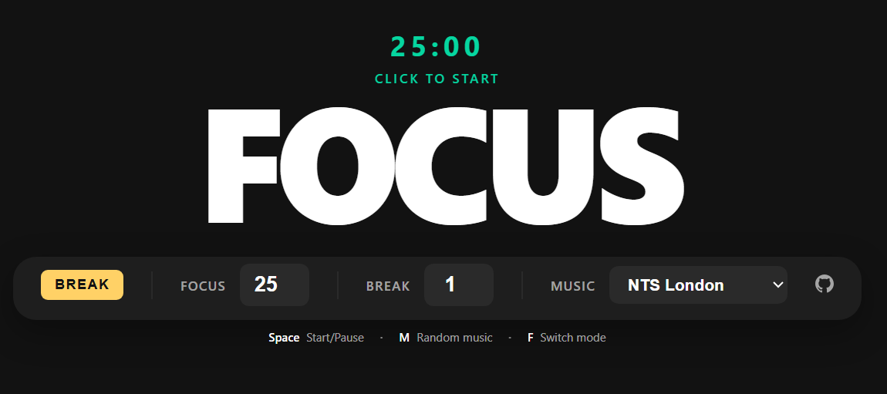

<h1 align="center"> Patata </h1>

<h3 align="center">A minimalist focus timer with integrated internet radio streaming.</h3>
<h4 align="center">https://tinykings.github.io/patata/</h4>

---




## Features

- **Pomodoro Timer** - Customizable focus and break durations
- **Music Streaming** - Play internet radio while you work
  - Groove Salad (SomaFM)
  - Drone Zone (SomaFM)
  - NTS London
  - NTS LA
- **Smooth Transitions** - Music fades in/out with timer state changes
- **Offline Support** - Install as a PWA for offline access
- **Auto Notifications** - Get notified when timers complete

## Getting Started

### Install Dependencies

```bash
npm install
```

### Development

```bash
npm run dev
```

### Build

```bash
npm run build
```

## Music Behavior

- Music plays when the timer starts
- 5 seconds before timer ends, music fades out
- When timer ends, music fades back in
- Pausing the timer stops the music immediately
- Changing stations while timer is running switches immediately

## PWA Installation

This app can be installed on desktop and mobile devices:

- **iOS**: Open in Safari, tap Share > Add to Home Screen
- **Android**: Open in Chrome, tap menu > Install app
- **Desktop**: Click the install icon in your browser's address bar

## Tech Stack

- React
- Vite
- vite-plugin-pwa
